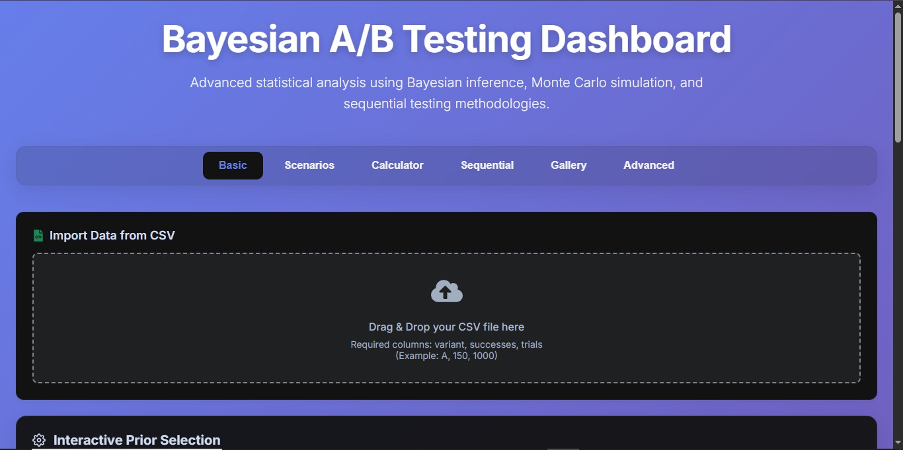
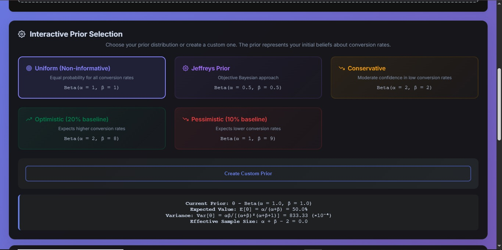
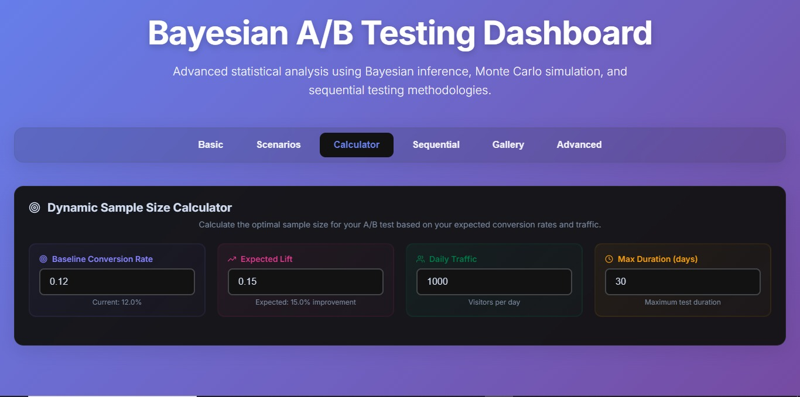
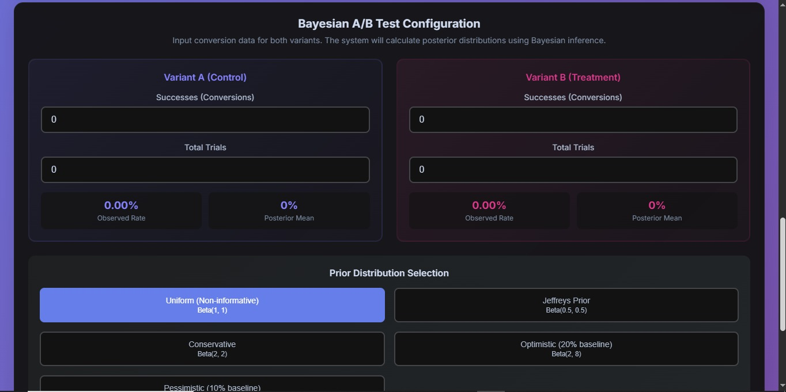
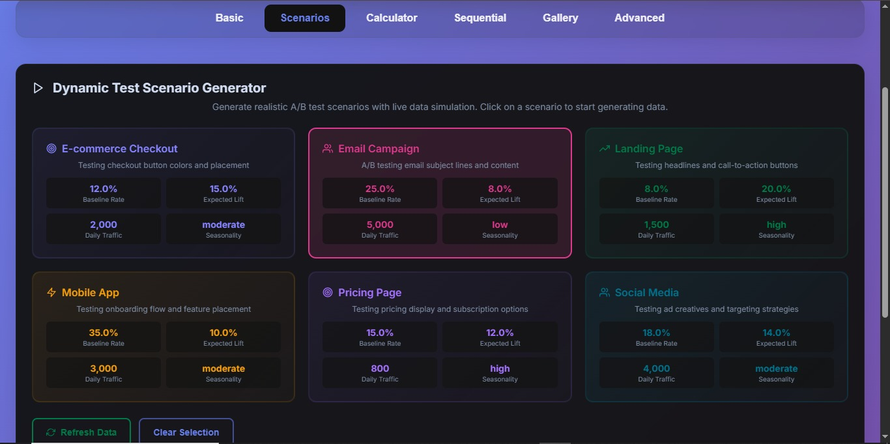
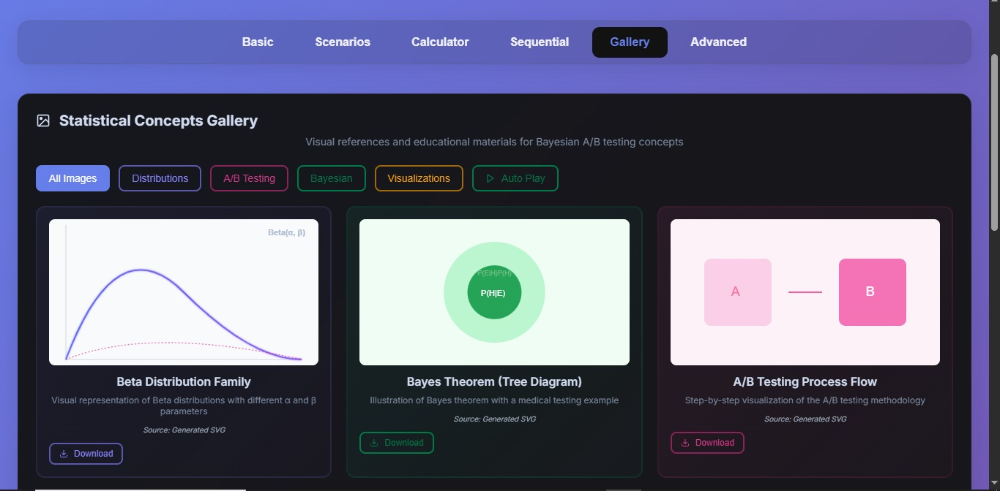

# Bayesian A/B Testing Dashboard

A sophisticated, mathematically rigorous Bayesian A/B testing platform designed for advanced conversion rate optimization. This dashboard combines cutting-edge Bayesian inference with a modern, glassmorphic UI.

## 🚀 Key Features

*   **Real-time Bayesian Analysis**: Instant calculation of Posterior distributions, P(B > A), and Expected Loss.
*   **Sequential Testing**: Time-series analysis with early stopping rules to save time and budget.
*   **Interactive Simulation**: Monte Carlo simulations and dynamic scenario generation.
*   **Robust Data Import**: Drag-and-drop CSV import for easy data analysis.
*   **Educational Gallery**: Visual library of statistical concepts.

## 📸 Visual Walkthrough

### 1. Main Dashboard & Calculator
The core interface for inputting data and viewing real-time statistical results, including probability gauges and credible intervals.


### 2. Data Import
Seamlessly import your experiment data via CSV files with robust parsing and validation.


### 3. Interactive Prior Selection
Configure your prior beliefs (Uniform, Optimistic, Pessimistic) to see how they influence the posterior.


### 4. Sequential Testing
Analyze tests over time to make faster decisions with early stopping boundaries.


### 5. Test Configuration
Detailed setup for simulation parameters and test scenarios.


### 6. Scenarios Generator
Simulate realistic A/B testing patterns to validate your statistical approach.


### 7. Statistical Gallery
A curated collection of educational visualizations for Bayesian concepts.


## 🧮 Mathematical Engine

This project uses a **Beta-Binomial conjugate model** supported by:
*   **Monte Carlo Integration** (10,000 samples)
*   **Cheng's Algorithm** for Beta sampling
*   **Log-space precision** for numerical stability

## 🛠️ Tech Stack
*   **React 18** (Hooks, Context)
*   **Styled Components** (Glassmorphism design)
*   **Framer Motion** (Smooth animations)
*   **Chart.js** (Data visualization)
*   **Papa Parse** (CSV processing)

## 🚀 Getting Started

```bash
# Install dependencies
npm install

# Start the dashboard
npm start
```

---
**Built for statistical precision and academic excellence.**
